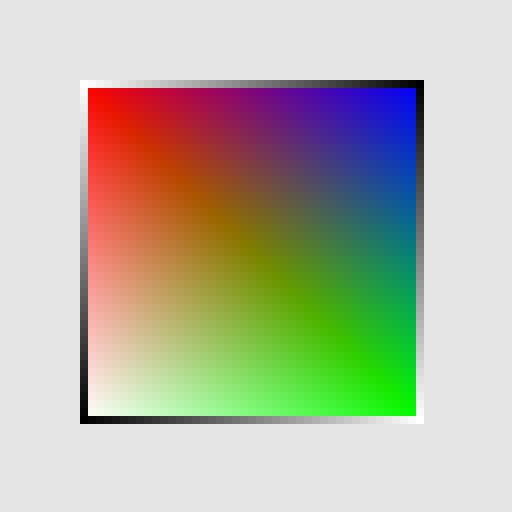

# SFU CMPT 361 Assignment 3: Rasterizing Lines and Triangles!

In this assignment, you will implement rasterization algorithms that allow you to draw lines and solid triangles!

# Getting started
To run and develop this assignment you must start a local HTTP server in the directory containing `a3.html`.
The simplest way is using python.
In MacOS and Linux `python3 -m http.server` in a terminal should work out of the box.
For Windows or in case of any trouble, see [these instructions](https://developer.mozilla.org/en-US/docs/Learn/Common_questions/set_up_a_local_testing_server#running_a_simple_local_http_server).
Once the HTTP server is up, navigate your browser to [http://localhost:8000/a3.html](http://localhost:8000/a3.html).
If you find the browser does not reflect updates in the code after refreshing, try clearing the browser cache. See this [stackoverflow question](https://stackoverflow.com/questions/5690269/disabling-chrome-cache-for-website-development) for Chrome, and similar ones for other browsers.

# Implementation instructions

We are using a simple framebuffer that you can control using the function `setPixel(x, y, color)` where `x` and `y` specify integer pixel coordinates along the horizontal and vertical axes respectively, with the top-left corner of the image being the origin. The `color` variable is an array containing RGB color values (i.e. `color = [R, G, B]`), each represeting as a floating point value in `[0,1]`.

The assignment uses simple text-driven input to specify what we should rasterize.
We use the following syntax:
- `v,x,y,r,g,b;` specifies a vertex position at `x,y` with color value `color = [r, g, b]`. The order in which lines starting with `v` are provided defines an index for each vertex `v`. That is, the first `v` line is the 0-th vertex, the second line is the 1-th vertex etc.
- `p,i;` specifies a point (i.e. "pixel") defined by the vertex with index `i`.
- `l,i,j;` specifies a line defined by the start and end vertices with index `i` and `j` respectively.
- `t,i,j,k;` specifies a triangle defined by the three vertices with indices `i`, `j` and `k`.

You can change the contents of the text box to add vertices as well as point, line and triangle definitions using the defined vertices.
Clicking the "Update" button will refresh the image output.
The starter code will produce a single pixel at each vertex.
Your job is to implement the logic that will rasterize solid lines and triangles with interpolated colors!

Here is a suggested guide for how to approach this assignment:
1. First, implement line rasterization (see Chapter 8.8-8.9), for now with a constant color value along the line. Start with handling the simple case of slope less than one, and then extend your code to handle other cases. You may base your implementation on the DDA algorithm, correctly extended to handle lines in all orientations. Your implementation should be filled into the `drawLine` function. [2 pt]
2. Implement color interpolation along the line. Assume linear interpolation along each RGB color channel from the start to the end of the line. To do this, you will need to define a [0,1] "distance" along the line from start to end points and use the fraction covered up to the current point. You may find it useful to create a helper function but in the end your code will need to be called from the `drawLine` function to interpolate line color from start to end. [1 pt]
3. Implement a triangle inside-outside test function to determine whether a pixel is inside a triangle (see Chapter 8.10.1 and Lecture G4). You may base your implementation on the half-plane algorithm described in Lecture G4. You may find it useful to create a helper function `pointIsInsideTriangle(v1,v2,v3,p)` which you can call from `drawTriangle`. [3 pt]
4. Use the above test to implement triangle rasterization in function `drawTriangle`. Your implementation should avoid naively checking all pixel points. For now, don't worry about colors (you can use a constant color for the entire triangle). [2 pt]
5. Implement barycentric color interpolation to determine the color value at each pixel inside a triangle. You may find it helpful to define a helper function `barycentricCoordinates`. [2 pt]
6. Bonus: do something creative! Now that you can rasterize lines and triangles, have fun with creating an interesting and visually appealing image. Make sure to save the input text that produces this creative artifact into the `DEF_INPUT` variable. [1 pt]

A bonus point is available for handing in the assignment by the suggested due date.

Some additional points on implementation details:
- You should only add code to `a3.js`. No other file should be changed, and you should also not change the import and export statements at the top and bottom of `a3.js`.
- Be careful to handle cases such as line endpoints starting and ending at higher or lower `x` and `y` values, or endpoints falling in the same pixel.
- Also be careful to handle cases such as adjacent triangles sharing an edge (there should be no gaps between such triangles, and pixels should be colored in only once so that the order in which triangles are rasterized does not matter)
- Note that in this assignment we only work with positive (`x`,`y`) coordinates on the plane.
- A bonus point is available for handling some of the hardest corner cases.
- You will likely need to use some functions from the Javascript `Math` library (e.g., `Math.min()`).
- You are not allowed to use any external libraries, or to copy code from anywhere without appropriate attribution. The assignment should only require simple math operations that you can achieve using JavaScript and a handful of functions from the built-in `Math` library.

The default input should produce an image like the below when you have completed all parts of the assignment:

You are free to discuss this assignment online on the CourSys discussion forum, or elsewere but you need to implement this assignment individually and by yourself.  We will not tolerate any breach of academic integrity (copying code from other students or elsewhere, providing code to other students).

Submit only your completed `a3.js` file to CourSys.
Your implementation must function correctly with all other files as provided in the starter code.
